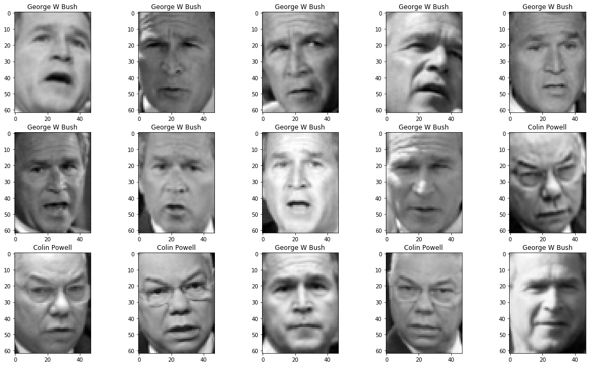

# sklearn-knn-test
## Abstract
 > This repo goal is to show the usage of a facial recognition algorithm : The _**KNN algorithm**_ (K nearest-neighbours). The used images for the execution of this algorithm are Georges W. Bush and Colin Powell photos. [**K-Nearest Neighbors** Algorithm definition](https://en.wikipedia.org/wiki/K-nearest_neighbors_algorithm "k-nearest neighbors algorithm")
___
## Notebook's code step

## 1. Useful libraries importation
```python
import pandas as pd
import numpy as np
import numpy.linalg as linalg
import matplotlib.pylab as pylab
```
## 2. Sklearn library images importation
```python
from sklearn.datasets import fetch_lfw_people
lfw_dataset = fetch_lfw_people(min_faces_per_person=200) # To keep people who got 200 images or more
import time as time # To calculate time execution
from sklearn.model_selection import train_test_split # To split data
```
___
## 3. Images display
```python
# I only show the first images of the X dataset, with the corresponding names
pylab.figure(figsize=(20,20))
for i in range(15):
    pylab.subplot(5,5,i+1)
    pylab.imshow(X[i,:].reshape((img_height, img_width)), cmap=pylab.plt.cm.gray) # figure's display
    pylab.title(names[y[i]])
pylab.show()
```

The labels of above images are : [1 1 1 1 1 1 1 1 1 0 0 0 1 0 1] (y=1) for George W Bush and (y=0) for Colin Powell
___
## 4. **KNN Algorithm** Applications
* Preparation of datasets
```python
X_train, X_test, y_train, y_test = train_test_split(X, y, test_size=0.3)
```
I have seperated the dataset randomly in two parts. The algorithm is trained with `X_train` and `y_train`. The algorithm is tested on `X_test` and `y_test`. The `test_size` variable is used to specify the wished data proportion.
* ## First _KNN Algorithm_ application with the `X_test` and `X_train` matrix and the `distance` function
```python
n_test = X_test.shape[0] # number of individuals in the test sample
n_train = X_train.shape[0] # number of individuals in the train sample
y_pred = np.zeros(n_test) # Initialization of the predictions vector
t1=time.time()
for i in range(n_test):
    mini_index=0
    for j in range(n_train):
        if (distance(X_test[i,:],X_train[j,:])<distance(X_test[i,:],X_train[mini_index,:])):
            mini_index=j
    y_pred[i]=y_train[mini_index]
t2=time.time()
print(f'The time execution of the KNN Algorithm with the X_test and X_train matrix and the distance function is : {t2-t1} seconds')
```
> The time execution of the KNN Algorithm with the X_test and X_train matrix and the distance function is : 185.7907428741455 seconds

Then the displays of the percentage of good classifications, the C. Powell and G.W Bush detection

```python
print('Percentage of good classifications :', 1-sum((y_pred-y_test)**2)/n_test)
print('Percentage of C. Powel detected :', 1-sum(y_pred[y_test==0])/sum(y_test==0))
print('Percentage of G. W. Bush detected :', sum(y_pred[y_test==1])/sum(y_test==1))
```
Percentage of good classifications : 0.8652173913043478\
Percentage of C. Powel detected : 0.6987951807228916\
Percentage of G. W. Bush detected : 0.9591836734693877

* ## Second application _**KNN algorithm**_ application with the PCA values and the `distance` function
```python
valtemp, Ptemp = eigh(P)
valPropres = sort(valtemp)[::-1]
indexsort = argsort(valtemp)[::-1]
D=diag(valPropres)
```
```python
C_train = C[:,0:D.size]
C_test = np.dot(normalise(X_test),P)[:,0:D.size]
print(np.shape(C_train))
print(np.shape(C_test))
```
```python
nc_test= C_test.shape[0] # number of individuals in the test sample
nc_train = C_train.shape[0] # number of individuals in the test sample
yc_pred = np.zeros(nc_test) # Initialization of the predictions vector
t1_nc=time.time()
for i in range(n_test):
    mini_index=0
    for j in range(nc_train):
        if (distance(C_test[i,:],C_train[j,:])<distance(C_test[i,:],C_train[mini_index,:])):
            mini_index=j
    yc_pred[i]=y_train[mini_index]
t2_nc=time.time()
print(f'The time execution of the KNN Algorithm with the C_test and C_train matrix and the distance function is : {t2_nc-t1_nc} seconds')
```
> The time execution of the KNN Algorithm with the C_test and C_train matrix and the distance function is : 135.74484539031982 seconds
```python
print('Percentage of good classifications :', 1-sum((yc_pred-y_test)**2)/nc_test)
print('Percentage of C. Powell detected :', 1-sum(yc_pred[y_test==0])/sum(y_test==0))
print('Percentage of G.W Bush detected :', sum(yc_pred[y_test==1])/sum(y_test==1))
```
Percentage of good classifications : 0.8652173913043478\
Percentage of C. Powell detected : 0.7349397590361446\
Percentage of G.W Bush detected : 0.9387755102040817

* ### `dissimilarite` function to measure the similirarities between `I1` and `I2` : 

```python
def dissimilarite(I1,I2):
    return 1-corrcoef(I1,I2)[0,1]**2
```

* ## Third _**KNN algorithm**_ application with the `X_train` and `X_test` matrix and the `dissimilarite` function:

```python
nd_test = X_test.shape[0] # number of individuals in the nd test sample
nd_train = X_train.shape[0] # number of individuals in the nd train sample
y_diss_pred = np.zeros(nd_test) # Initialization of the predictions vector
t1_diss=time.time()
for i in range(nd_test):
    mini_index_diss=0
    for j in range(nd_train):
        if (dissimilarite(X_test[i,:],X_train[j,:])<dissimilarite(X_test[i,:],X_train[mini_index,:])):
            mini_index_diss=j
    y_diss_pred[i]=y_train[mini_index_diss]
t2_diss=time.time()
print(f'The time execution of the KNN Algorithm with the X_test and X_train matrix and the dissimilarite function is : {t2_diss-t1_diss} seconds.')
```
> The time execution of the KNN Algorithm with the X_test and X_train matrix and the dissimilarite function is : 38.78929305076599 seconds.

```python
print('Percentage of good classifications :', 1-sum((y_diss_pred-y_test)**2)/nd_test)
print('Percentage of C. Powell detected :', 1-sum(y_diss_pred[y_test==0])/sum(y_test==0))
print('Percentage of G.W Bush detected :', sum(y_diss_pred[y_test==1])/sum(y_test==1))
```
Percentage of good classifications : 0.5173913043478261\
Percentage of C. Powell detected : 0.5783132530120482\
Percentage of G.W Bush detected : 0.48299319727891155

* ## Fourth application of the _**KNN algorithm**_ with the `dissimilarite` function and the PCA values

```python
nc_diss_test= C_test.shape[0] # nombre d'individus dans l'échantillon test
nc_diss_train = C_train.shape[0] # nombre d'individus dans l'échantillon train
yc_diss_pred = np.zeros(nc_test) # initialisation du vecteur des prédictions
t1_nc_diss=time.time()
for i in range(nc_diss_test):
    mini_index=0
    for j in range(nc_diss_train):
        if (dissimilarite(C_test[i,:],C_train[j,:])<dissimilarite(C_test[i,:],C_train[mini_index,:])):
            mini_index=j
    yc_diss_pred[i]=y_train[mini_index]
t2_nc_diss=_nc_diss==time.time()
print(f'The time execution of the KNN Algorithm with the C_test, C_train matrix and the dissimilarite function is : {t2_nc_diss-t1_nc_diss} seconds.')
```
  > The time execution of the KNN Algorithm with the C_test, C_train matrix and the dissimilarite function is : 39.58890962600708 seconds.

```python
print('Percentage of good classifications :', 1-sum((yc_diss_pred-y_test)**2)/nc_diss_test)
print('Percentage of C. Powell detected :', 1-sum(yc_diss_pred[y_test==0])/sum(y_test==0))
print('Percentage of G.W Bush detected :', sum(yc_diss_pred[y_test==1])/sum(y_test==1))
```
Percentage of good classifications : 0.8217391304347826\
Percentage of C. Powell detected : 0.6506024096385542\
Percentage of G.W Bush detected : 0.9183673469387755

___
## 5. Used functions
> The `distance` function take 2 images (as vectors) and return the euclidian distance between these 2 images.
```python
def distance(I1,I2):
    return np.sqrt(sum((I1-I2)**2))
```

> The normalize function which takes a M matrix as an argument and returns a normalised matrix.

```python
def normalise(M):
    n,p=M.shape
    N=np.zeros((n,p))
    for i in range(p):
        N[:,i]=(M[:,i]-np.mean(M[:,i]))/np.std(M[:,i])# To normalise each row
    return N
```
> The correlation function which takes a M matrix as an argument and return the correlation matrix associated to M.

```python
def correlation(M):
    Z= normalise(M)
    n=Z.shape[0]
    return 1/n*np.dot(Z.T,Z)
```
> The ACP function which takes a M matrix as an argument and returns the eigenvalues, the eigenvectors and the P matrix.
```python
def acp(M):
    n,p=M.shape
    R= correlation(M)
    valtemp, vectemp = linalg.eigh(R) # valeurs propres et vecteurs propres de la matrice de corrélation
    val = np.sort(valtemp)[::-1] # valeurs propres par ordre décroissant
    index = np.argsort(valtemp)[::-1] # indice du réarrangement des valeurs propres par ordre décroissant
    P=np.zeros((p,p)) # eigenvalue ordered base change matrix propres
    for i in range(p):
        P[:,i]=vectemp[:,index[i]]
    C=np.dot(normalise(M),P)
    return val, P, C
```